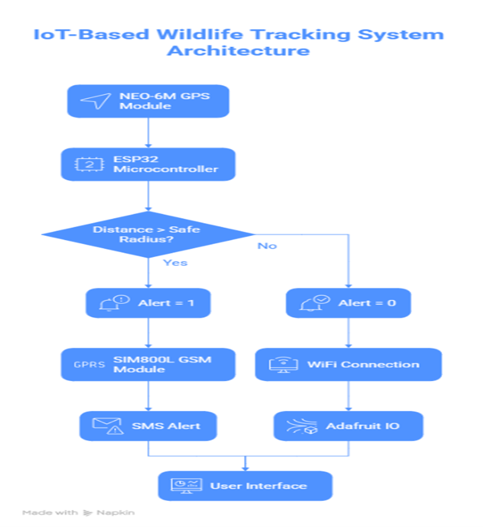
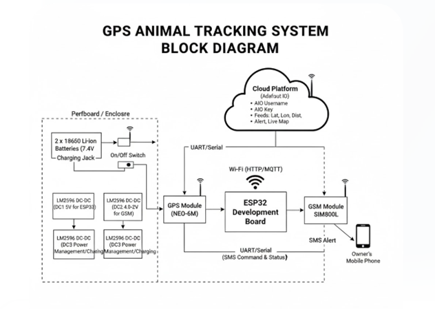
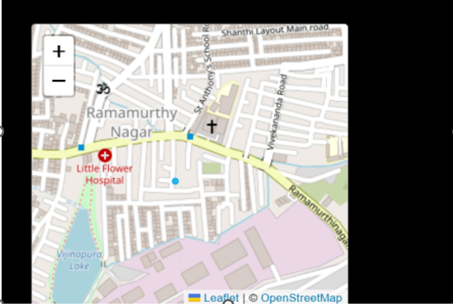

# 🐾 IoT-Based Wildlife Tracking & Geofencing System

An IoT-based system designed to track wildlife in real-time using GPS and send alerts when animals move beyond a defined safe zone.

---

## 🚀 Features
- 📍 Real-time GPS tracking
- 📡 Cloud monitoring using Adafruit IO
- 🚨 SMS alerts on geofence breach
- 📊 Live dashboard visualization
- 🔋 Portable hardware setup

---

## 🧠 System Architecture

---

## 🔧 Block Diagram

---

## 🔌 Circuit Diagram

---

## 🛠 Hardware Implementation

---

## 📊 Dashboard Output

---

## 💻 Tech Stack
- ESP32 Microcontroller  
- NEO-6M GPS Module  
- SIM800L GSM Module  
- Adafruit IO (Cloud Dashboard)  
- Arduino IDE  

---

## 📌 How It Works
1. GPS module collects real-time location  
2. ESP32 processes location data  
3. Distance from safe zone is calculated  
4. If exceeded → GSM sends SMS alert  
5. Data is also sent to cloud dashboard  

---

## 📈 Future Improvements
- Mobile app integration  
- Battery optimization  
- AI-based movement prediction  

---

## 👩‍💻 Author
**Vismaya Hiremath**
